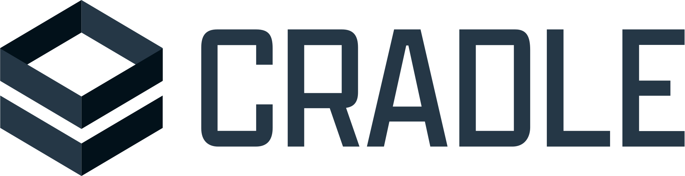

<a id="readme-top"></a>

<!-- PROJECT SHIELDS -->
[![Contributors][contributors-shield]][contributors-url]
[![Forks][forks-shield]][forks-url]
[![Stargazers][stars-shield]][stars-url]
[![Issues][issues-shield]][issues-url]
[![MIT License][license-shield]][license-url]

<!-- PROJECT LOGO -->
<br />
<div align="center">
  <a href="https://github.com/prodaft/cradle">
    <picture>
      <source media="(prefers-color-scheme: dark)" srcset="docs/static/images/logos/light.svg">
      <source media="(prefers-color-scheme: light)" srcset="docs/static/images/logos/dark.svg">
      
    </picture>
  </a>

  <h3 align="center">CRADLE</h3>

  <p align="center">
    Batteries Included Collaborative Threat Intelligence
    <br />
    <a href="https://cradle.sh/"><strong>Explore the docs »</strong></a>
    <br />
    <br />
    <a href="https://github.com/prodaft/cradle/issues/new">Report Bug</a>
    &middot;
    <a href="https://github.com/prodaft/cradle/issues/new">Request Feature</a>
  </p>
</div>

<!-- TABLE OF CONTENTS -->
<details>
  <summary>Table of Contents</summary>
  <ol>
    <li>
      <a href="#try-it-out">Try it out!</a>
      <a href="#about-the-project">About The Project</a>
      <ul>
        <li><a href="#repository-structure">Repository Structure</a></li>
        <li><a href="#built-with">Built With</a></li>
      </ul>
    </li>
    <li>
      <a href="#getting-started">Getting Started</a>
      <ul>
        <li><a href="#prerequisites">Prerequisites</a></li>
        <li><a href="#installation">Installation</a></li>
      </ul>
    </li>
    <li><a href="#contributing">Contributing</a></li>
    <li><a href="#acknowledgments">Acknowledgments</a></li>
    <li><a href="#license">License</a></li>
    <li><a href="#contact">Contact</a></li>
  </ol>
</details>


## Try it out!

```sh
git clone https://github.com/prodaft/cradle.git
cd cradle
docker compose -f docker-compose.demo.yml up -d
```

CRADLE should be accessible on `http://localhost:8000` with credentials `admin:admin`!

<!-- ABOUT THE PROJECT -->
## About The Project

CRADLE is an open-source web application designed to empower Cyber Threat
Intelligence (CTI) analysts. The platform streamlines threat analysis workflows
through collaborative note-taking, visual relationship mapping, and
comprehensive report generation.

Key Features:
- **Collaborative Investigation**: Shared workspace for team-based threat analysis
- **Entity Relationship Visualization**: Graphical representation of connections between threat actors and artifacts
- **Report Generation**: Exportable intelligence reports in multiple formats
- **Modular Architecture**: Easily extensible design for future enhancements

### Repository Structure

The monorepo is organized into three main components:

| Directory    | Description                                  | Documentation                   |
|--------------|----------------------------------------------|---------------------------------|
| `backend/`   | Django-based API and data processing layer   | [README](backend/README.md)     |
| `ui/`        | Electron/React frontend application          | [README](ui/README.md)          |
| `deploy/`    | Ansible playbooks and deployment scripts     |                                 |
| `docker/`    | Relevant dockerfiles and configurations      | [README](docker/README.md)      |

### Built With

[![Django][Django.com]][Django-url]
[![React][React.js]][React-url]
[![Electron][Electron.js]][Electron-url]
[![Postgres][Postgres.com]][Postgres-url]

<p align="right">(<a href="#readme-top">back to top</a>)</p>

<!-- GETTING STARTED -->
## Getting Started

### Prerequisites

- Docker 20.10+
- Docker Compose 2.0+
- Git

### Installation

1. Clone the repository
   ```sh
   git clone https://github.com/prodaft/cradle.git
   cd cradle
   ```
2. Start the Docker containers
   ```sh
   docker compose -f docker/docker-compose.demo.yml up -d
   ```
3. Access the application at `http://localhost:3000`

For advanced setup instructions, see the component-specific READMEs:
- [Backend Setup](backend/README.md)
- [Frontend Setup](ui/README.md)

<p align="right">(<a href="#readme-top">back to top</a>)</p>

<!-- CONTRIBUTING -->
## Contributing

We welcome contributions from the security community! Here's how to help:

1. Fork the Project
2. Create your Feature Branch (`git checkout -b feature/AmazingFeature`)
3. Commit your Changes (`git commit -m 'Add some AmazingFeature'`)
4. Push to the Branch (`git push origin feature/AmazingFeature`)
5. Open a Pull Request

## Acknowledgments

CRADLE is developed by PRODAFT in collaboration with students from TU Delft. Special thanks to everyone who contributes to making this project possible.

**Contributors**
- [Tudor Măgirescu](https://github.com/TudorMagirescu)
- [Călin-Marian Diacicov](https://github.com/klinashka)
- [Daniel Popovici](https://github.com/Babu-on-Github)
- [Matei Grigore](https://github.com/mateigrigore)
- [Razvan Dinu](https://github.com/razvand13)
- [Yigit Colakoglu](https://github.com/arg3t)

<p align="right">(<a href="#readme-top">back to top</a>)</p>

<!-- LICENSE -->
## License

Distributed under the MIT License. See `LICENSE` for more information.

<p align="right">(<a href="#readme-top">back to top</a>)</p>

<!-- CONTACT -->
## Contact

CATALYST Threat Intelligence Team - [@prodaft](https://twitter.com/prodaft) - catalyst.prodaft.com

Project Link: [https://github.com/prodaft/cradle](https://github.com/prodaft/cradle)

<p align="right">(<a href="#readme-top">back to top</a>)</p>

<!-- MARKDOWN LINKS & IMAGES -->
[contributors-shield]: https://img.shields.io/github/contributors/prodaft/cradle.svg?style=for-the-badge
[contributors-url]: https://github.com/prodaft/cradle/graphs/contributors
[forks-shield]: https://img.shields.io/github/forks/prodaft/cradle.svg?style=for-the-badge
[forks-url]: https://github.com/prodaft/cradle/network/members
[stars-shield]: https://img.shields.io/github/stars/prodaft/cradle.svg?style=for-the-badge
[stars-url]: https://github.com/prodaft/cradle/stargazers
[issues-shield]: https://img.shields.io/github/issues/prodaft/cradle.svg?style=for-the-badge
[issues-url]: https://github.com/prodaft/cradle/issues
[license-shield]: https://img.shields.io/github/license/prodaft/cradle.svg?style=for-the-badge
[license-url]: https://github.com/prodaft/cradle/blob/master/LICENSE

[Django.com]: https://img.shields.io/badge/Django-092E20?style=for-the-badge&logo=django&logoColor=white
[Django-url]: https://www.djangoproject.com/
[React.js]: https://img.shields.io/badge/React-20232A?style=for-the-badge&logo=react&logoColor=61DAFB
[React-url]: https://reactjs.org/
[Electron.js]: https://img.shields.io/badge/Electron-191970?style=for-the-badge&logo=electron&logoColor=white
[Electron-url]: https://www.electronjs.org/
[Postgres.com]: https://img.shields.io/badge/PostgreSQL-316192?style=for-the-badge&logo=postgresql&logoColor=white
[Postgres-url]: https://www.postgresql.org/
