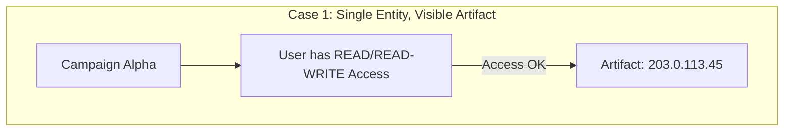
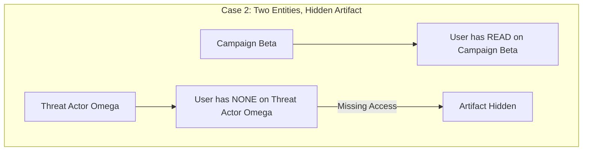
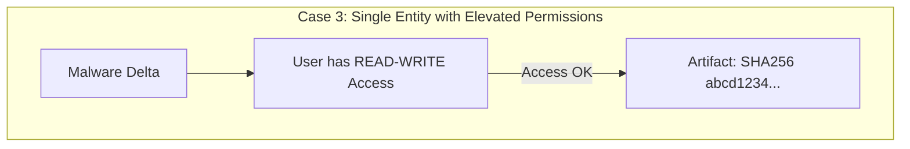
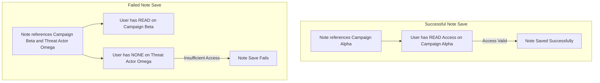

+++
title = "Users and Access"
date = "2025-03-05T12:55:52+01:00"
draft = false
weight = 2
+++

CRADLE implements an entity-level access control system to manage which entries
and notes users can access. The system is built on a strict permission model
with three access levels.

## Access levels

1. None (default)
   - Cannot view notes referencing the entity.
   - Cannot create notes referencing the entity.

2. Read
   - Can view notes referencing the entity.
   - Cannot create notes referencing the entity.

3. Read-write
   - Can view notes referencing the entity.
   - Can create notes referencing the entity.

## Key rules

1. Note access rule
   A user can view a note only if they have read or read-write access to all
   entities referenced in that note.

2. Default access
   Users are granted none access by default unless higher permissions are
   explicitly assigned.

3. Superuser privileges
   Admins automatically have read-write access to all entities and their
   permissions are not stored in the database.

4. Roles
   - Admin: Full permissions and user management.
   - Manager: Manages system configuration and content, excluding user admin.
   - Entry manager: Manage entry classes and edit entity metadata.
   - User: Base access for creating and viewing notes.

## Access management

1. Admin capabilities
   - Modify access levels for any non-admin user.
   - Cannot modify access levels for other admins.

2. Users with read-write access
   - Can grant access to other users for entities they control.
   - Cannot modify access for admins or users who already have read-write
     access.

3. Access requests
   - Users can request access to entities they cannot view.
   - Users with read-write access receive notifications.

## Artifact visibility cases

## Note saving examples

