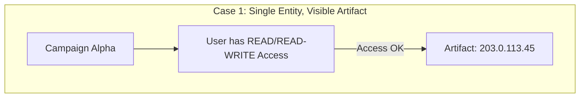
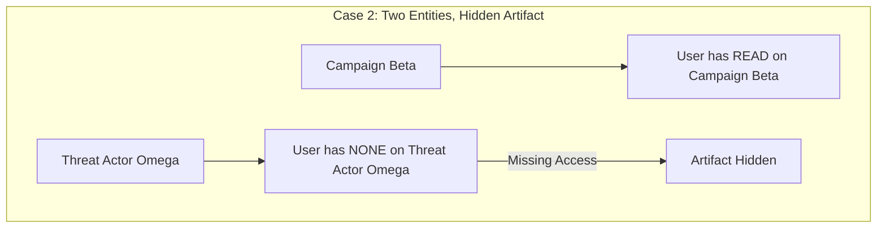
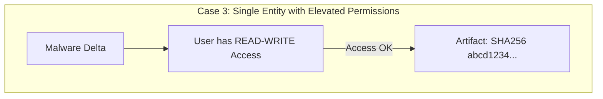
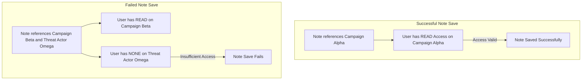

+++
date = "2025-03-05T14:00:00+01:00"
draft = false
linkTitle = "Access Control"
title = "Access Control Mechanism"
weight = 6
+++

CRADLE implements an entity-level access control system to manage which entries and notes users can access. The system is built on a strict permission model with three distinct access levels.

## Access Levels

Users may have one of the following access levels for any entity:

1. **NONE** (Default)
   - Cannot view notes referencing the entity.
   - Cannot create notes referencing the entity.

2. **READ**
   - Can view notes referencing the entity.
   - Cannot create notes referencing the entity.

3. **READ-WRITE**
   - Can view notes referencing the entity.
   - Can create notes referencing the entity.

## Key Rules

1. **Note Access Rule:**
   A user can view a note only if they have either READ or READ-WRITE access to **all** entities referenced in that note.

2. **Default Access:**
   Users are granted NONE access by default unless higher permissions are explicitly assigned.

3. **Superuser Privileges:**
   - Superusers (admins) automatically have READ-WRITE access to all entities.
   - Their permissions are inherent and not stored in the database.

4. **Roles:**
   Each user is assigned a role that defines additional capabilities within CRADLE:
   - **Admin:** Has full permissions for all entities and can manage users and their access levels.
   - **Entry Manager:** Can create, read, and update entry classes, and edit metadata for entities they have READ-WRITE access to.
   - **User:** The base permission level; can view and write notes for entities they have access to.

## Access Management

1. **Admin Capabilities:**
   - Admins can modify access levels for any non-admin user.
   - Admins cannot modify the access levels of other admins.

2. **Users with READ-WRITE Access:**
   - Can grant access to other users for entities they control.
   - Cannot modify access for:
     - Admin users.
     - Users who already have READ-WRITE access.

3. **Access Requests:**
   - Users can request access to entities they currently cannot view.
   - All users with READ-WRITE access to the entity will receive a notification.
   - The request system streamlines the process of managing permissions.

## Artifact Visibility Cases

The following diagram shows three small examples where artifact visibility is decided based on user access to the referenced entities:

## Note Saving Examples

Below is a diagram depicting two scenarios for saving a note: one where the note save is successful, and one where it fails due to insufficient access.

### Navigation


  
  

